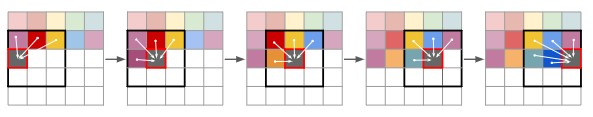

# Blog post for Deep Learning course

## Introduction
In this blog, the mix of transformers with convolutional VQGAN and its applications are explained. In 2021, P. Esser, R. Rombach, and B. Ommer combine transformers and CNNs to generate images, with the ability to add conditional synthesis tasks, such as segmentations, to control the generated image. Their results, at the time, obtained state of the art among autoregressive models on class-conditional ImageNet. Our goal for this blog is to provide the reader with a brief look into the combination of VQGANs and transformers, a from scratch PyTorch implementation of the VQGAN, retraining of the original models, and the application of the authors work to a dataset of Atari environments (Montezuma's revenge).

Our motivation for implementing this paper stems from its use in another paper we were originally interested in, namely "Transformers are sample-efficient world models" by V. Micheli, E. Alonso, F. Fleuret. The authors implement the VQGANs by Esser et. al. in their discrete autoencoder in a deep reinforcement learning agent that is data-efficient. We realised that we did not fully understand the mechanics behind the agent, which is why we ultimately decided to implement "Taming Transformers for High-Resolution Image Synthesis". Micheli et. al. implement this agent to Atari environments, hence why we chose Montezuma's revenge as a new dataset to apply the VQGANs to.

[comment]: <> (In this paragraph we explain the paper shortly -> what it does and tries to achieve.)

The author's state their goal as follows: "...to exploit the highly promising learning capabilities of transformer models and introduce them to high-resolution image synthesis...". They split their approach into 2 parts, namely: learning an effective codebook of image constituents for use in transformers, and learning the composition of images with transformers. The idea is to feed the transformer model with a codebook that represents the image, instead of the pixels that represent the image. This results in significant reductions of the description length of compositions, allowing the transformers to understand the global composition of images, and generate realistic high resolution images. We now go over these two parts and explain these more in-depth.

To learn an effective codebook, we first need to express the constituents of an image in the form of a sequence. This is because the transformer's architecture is a lot more suitable for this kind of data structure, and thus can be utilized better. To do so, the authors utilize discrete codebooks to represent images. By definition, a discrete codebook is a collection of codebook entries, $z_{\mathbf{q}} \in \mathbb{R}^{h \times w \times n_z}$, where $n_z$ is the dimensionality of codes. A more in depth explanation of what happens next with encoders, decoders and the VQGAN itself will be explained in the following section, where we build the VQGAN from scratch.

After the model is able to learn an effective codebook, i.e. $E$ (encoder) and $G$ (decoder) are available, we can train a transformer on the quantized encoding $z_{\mathbf{q}}$ of the image $x$. Notice that this is equivalent to a sequence $s \in \{0, \dots, |\mathcal{Z}-1|\}^{h\times w}$ of indices from the codebook, i.e. 
$$s_{ij} = k, \text{ s.t. } (z_{\mathbf{q}})_{ij} = z_k.$$

The transformer learns to predict the distribution of possible next indices, $p(s_i|s_1, \dots, s_{i-1})$, which results in the following loss function we want to maximize:
$$\mathcal{L}_{\text{Transformer}} = -\mathbb{E}_{x\sim p(x)}[\log p(s)].$$

The beauty of this approach is that we can now add a condition $c$ to the probability distribution for which the transformer can learn from, i.e.
$$p(s|c) = \prod_{i} p(s_i | s_1, \dots, s_{i-1}, c).$$
This condition can be anything; a single label, another image, or a segmentation of an image, etc.

Finally to generate the images, the transformer is used in a sliding-window manner, which can be seen in the figure below.




Now that we have a detailed overview of the overarching model, we look into the nitty-gritty details of the VQGAN.
## Building the VQGAN from Scratch
The VQGAN model is an autoencoder that utilizes vector quantization as a bottleneck between the encoder and decoder. This quantization technique has a similar effect to reducing the size of layers in the middle of a stacked autoencoder or by having the encoder output the sufficient statistics of a normal distribution and, sampling from this distribution, and feeding the sample to the decoder (as in a variational autoencoder). Quantization has an advantage over sampling in that it doesn't result in blurry output for the decoded image, unlike sampling which often produces blurry images.

Below you can see a visualization of the VQGAN.


The model consists of an encoder, a decoder, and a discriminator that differentiates real from fake images, making it a VQGAN rather than just a VQVAE. While the entire model was implemented from scratch, we will focus on a small segment of the code that handles vector quantization.
```python
class Codebook(nn.Module):
    def __init__(self,args):
        super(Codebook,self).__init__()
        self.num_codebook_vectors = args.num_codebook_vectors
        self.latent_dim = args.latent_dim
        self.beta = args.beta

        self.embedding = nn.Embedding(self.num_codebook_vectors,self.latent_dim) # matrix with as rows the different embedding vectors

        # takes as input tensor with indices, output will be a tensor containing all the requested embedding vectors that corr with the indices
        self.embedding.weight.data.uniform_(-1.0/self.num_codebook_vectors,1.0/self.num_codebook_vectors) #the learnable weights of the module of shape (num_embeddings, embedding_dim) initialized uniformly now

    def forward(self,z):
        # z is normally of shape (batch_size,channels,height, width), after permutation its (batch_size, height,width,channels)
        z = z.permute(0,2,3,1).contiguous() # prepending latent vectors for finding the minimal distance to the codebook vectors
        z_flattened = z.view(-1,self.latent_dim)

        d = torch.sum(z_flattened**2,dim=1,keepdim=True)+\
            torch.sum(self.embedding.weight**2, dim=1)-\
            2*(torch.matmul(z_flattened,self.embedding.weight.t()))

        min_enc_indices = torch.argmin(d,dim=1)
        z_q = self.embedding(min_enc_indices).view(z.shape)
        loss = torch.mean((z_q.detach()-z)**2)+ self.beta * torch.mean((z_q-z.detach())**2)
        # above we first remove the gradient from the quantized latent vectors from the gradient flow and substract it from the original latent vector
        # in the second part we remove tha gradient from the original latent vector and keep the one of the quantized latent vector and substract them

        z_q = z + (z_q-z).detach() # here we make sure that z_q has the gradient of z but keeps its quantized value
        z_q = z_q.permute(0,3,1,2)

        return z_q, min_enc_indices, loss
```

Here we construct a Codebook class with `self.num_codebook_vectors` number of codebook vectors. Each having dimension `self.latent_dim`.
The codebook vectors are stored in a `nn.Embedding` layer, with `self.num_codebook_vectors` number of embeddings each of size `self.latent_dim`.

In the forward function we see that we start with a $z$ with dimension $[N,H,W,C]$, where $N$ is the batch size $H$ is the height of the image $W$ is the width of the image and $C$ is the number of channels in of the image. Which we then permute and reshape to get a $z_{flattened}$ which has the shape of $[N\cdot H \cdot W,C]$. We then calculate the euclidean distance of $z_{flattened}$ to every codebook vector and store these distances in $d$. After which we calculate the indices corresponding to the smallest distances, and store the result in `min_enc_indices`. The quantized latent vectors $z_q$ are then obtained through indexing the codebook with `self.embedding(min_enc_indices)`.

To relate what has happened up to this point to the image shown before, putting the code into more mathematical terms we've done the following:
$$z_{\mathbf{q}} = \arg \min_{z_i \in \mathcal{Z}} ||\hat{z}-z||$$
Where $\mathcal{Z}$ is the codebook.

Now, the quantized $z_{\mathbf{q}}$ does not have the gradients of $z$. To ensure that they do have the same gradient we use a trick that is referred to as the straight through estimator: `z_q = z + (z_q-z).detach() `. We keep the value of $z_q$ equal to its original value but it has the exact same gradients as $z$. This is because $z$ gets canceled by $(z_q-z)$,  however the gradient will not be canceled because of the `.detach()` method that was called on it.

All in all, the VQGAN model is a powerful tool for generating high quality images using vector quantization in the autoencoder architecture together with a discriminator.
The code above is written in PyTorch, whereas the code on the github page was written in pytorch lightning so we also changed the framework.

## Running the Paper's VQGAN + Transformer on old data

To verify the claims of the original paper, we decided to run multiple experiments on the COCO dataset which is also used by the authors.


Explain how to run the original code on the old dataset. Also explain why COCO and the motivation.

Show images generated.


## Running the Paper's VQGAN + Transformer on new data
Motivate why the Atari data.

Show images generated.


## FID Scores
Add table for FID scores.


## Conclusion
Conclude the paper -> they can actually make images, but we cannot recreate exact results due to computational power (lack thereof).
