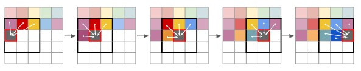
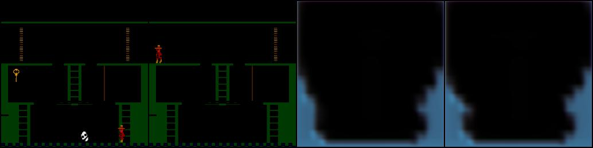
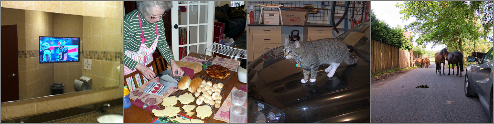
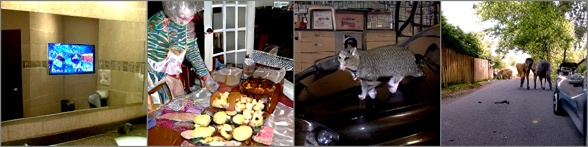
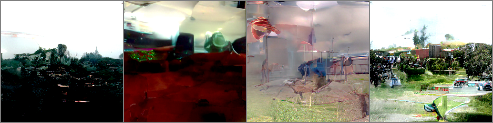
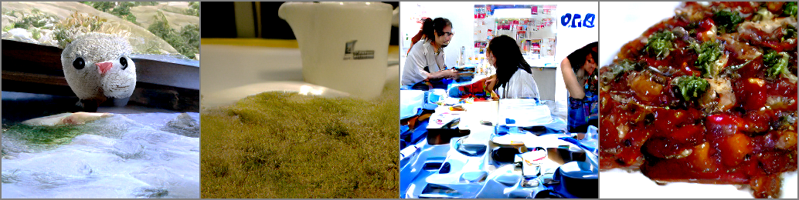
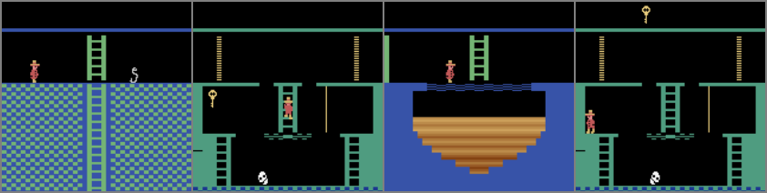
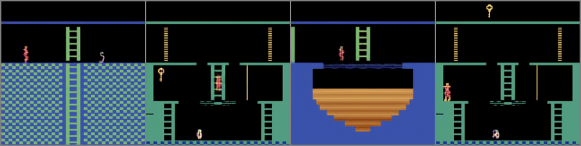

# CS4240 – Reproductions of Taming Transformers for High-Resolution Image Synthesis

By **Group 22**: Albin Jaldevik (5839408,R.a.jaldevik@student.tudelft.nl), Avi Halevy (5175208, A.L.Halevy@student.tudelft.nl), and Aadam Wiggers (5839408, Aagwiggers@student.tudelft.nl) .

Primary tasks:
- **Reproduced**: Existing code was evaluated. We conducted experiments with the COCO dataset, just like the authors.
- **New data**: Evaluating different datasets to obtain similar results. We trained the model on images from Montezuma's revenge.
- **New code variant**: Rewrote or ported existing code to be more efficient/readable. We ported the full VQGAN to pure Pytorch. See [VQ_GAN2.ipynb](VQ_GAN2.ipynb).


[Original paper](https://openaccess.thecvf.com/content/CVPR2021/html/Esser_Taming_Transformers_for_High-Resolution_Image_Synthesis_CVPR_2021_paper.html?ref=https://githubhelp.com)


## Introduction
In this blog, the mix of transformers with convolutional VQGAN and its applications are explained. In 2021, P. Esser, R. Rombach, and B. Ommer combine transformers and CNNs to generate images, with the ability to add conditional synthesis tasks, such as segmentations, to control the generated image. Their results, at the time, obtained state of the art among autoregressive models on class-conditional ImageNet. Our goal for this blog is to provide the reader with a brief look into the combination of VQGANs and transformers, a from scratch PyTorch implementation of the VQGAN, retraining of the original models, and the application of the authors work to a dataset of Atari environments (Montezuma's revenge).

Our motivation for implementing this paper stems from its use in another paper we were originally interested in, namely "Transformers are sample-efficient world models" by V. Micheli, E. Alonso, F. Fleuret. The authors implement the VQGANs by Esser et. al. in their discrete autoencoder in a deep reinforcement learning agent that is data-efficient. We realised that we did not fully understand the mechanics behind the agent, which is why we ultimately decided to implement "Taming Transformers for High-Resolution Image Synthesis". Micheli et. al. implement this agent to Atari environments, hence why we chose Montezuma's revenge as a new dataset to apply the VQGANs to.The authors state their goal as follows: "...to exploit the highly promising learning capabilities of transformer models and introduce them to high-resolution image synthesis...". They split their approach into 2 parts, namely: learning an effective codebook of image constituents for use in transformers, and learning the composition of images with transformers. The idea is to feed the transformer model with a codebook that represents the image, instead of the pixels that represent the image. This results in a significant reduction of the description length of compositions, allowing the transformers to understand the global composition of images, and generate realistic high resolution images. We now go over these two parts and explain them more in-depth.

To learn an effective codebook, we first need to express the constituents of an image in the form of a sequence. This is because the transformer's architecture is a lot more suitable for this kind of data structure, and thus can be utilized better. To do so, the authors utilize discrete codebooks to represent images. By definition, a discrete codebook is a collection of codebook entries, $z_{\mathbf{q}} \in \mathbb{R}^{h \times w \times n_z}$, where $n_z$ is the dimensionality of codes. A more in depth explanation of what happens next with encoders, decoders and the VQGAN itself will be explained in the following section, where we build the VQGAN from scratch.

After the model is able to learn an effective codebook, i.e. $E$ (encoder) and $G$ (decoder) are available, we can train a transformer on the quantized encoding $z_{\mathbf{q}}$ of the image $x$. Notice that this is equivalent to a sequence $s \in \{0, \dots, |\mathcal{Z}-1|\}^{h\times w}$ of indices from the codebook, i.e.
$$s_{ij} = k, \text{ s.t. } (z_{\mathbf{q}})_{ij} = z_k.$$

The transformer learns to predict the distribution of possible next indices, $p(s_i|s_1, \dots, s_{i-1})$, which results in the following loss function we want to maximize:
$$\mathcal{L}_{\text{Transformer}} = -\mathbb{E}_{x\sim p(x)}[\log p(s)].$$

The beauty of this approach is that we can now add a condition $c$ to the probability distribution for which the transformer can learn from, i.e.
$$p(s|c) = \prod_{i} p(s_i | s_1, \dots, s_{i-1}, c).$$
This condition can be anything; a single label, another image, or a segmentation of an image, etc.

Finally to generate the images, the transformer is used in a sliding-window manner, which can be seen in the figure below.




[comment]: <> (here we add the computation bit, fix the sentence above)

Training both the transformer and VQGAN are very computationally expensive. Therefore, we ran our training on a Google Cloud VM with an NVIDIA T4 GPU. This was still not enough computational power to train on the more complex datasets, such as the COCO dataset, which resulted in some concessions that we had to make, detailed in their specific subsections.


Now that we have a detailed overview of the overarching model, we look into the nitty-gritty details of the VQGAN.

## Building the VQGAN from Scratch
The VQGAN model is an autoencoder that utilizes vector quantization as a bottleneck between the encoder and decoder. This quantization technique has a similar effect to reducing the size of layers in the middle of a stacked autoencoder or by having the encoder output the sufficient statistics of a normal distribution and, sampling from this distribution, and feeding the sample to the decoder (as in a variational autoencoder). Quantization has an advantage over sampling in that it doesn't result in blurry output for the decoded image, unlike sampling which often produces blurry images.

Below you can see a visualization of the VQGAN.


The model consists of an encoder, a decoder, and a discriminator that differentiates real from fake images, making it a VQGAN rather than just a VQVAE. While the entire model was implemented from scratch, we will focus on a small segment of the code that handles vector quantization.
```python
class Codebook(nn.Module):
    def __init__(self,args):
        super(Codebook,self).__init__()
        self.num_codebook_vectors = args.num_codebook_vectors
        self.latent_dim = args.latent_dim
        self.beta = args.beta

        self.embedding = nn.Embedding(self.num_codebook_vectors,self.latent_dim) # matrix with as rows the different embedding vectors

        # takes as input tensor with indices, output will be a tensor containing all the requested embedding vectors that corr with the indices
        self.embedding.weight.data.uniform_(-1.0/self.num_codebook_vectors,1.0/self.num_codebook_vectors) #the learnable weights of the module of shape (num_embeddings, embedding_dim) initialized uniformly now

    def forward(self,z):
        # z is normally of shape (batch_size,channels,height, width), after permutation its (batch_size, height,width,channels)
        z = z.permute(0,2,3,1).contiguous() # prepending latent vectors for finding the minimal distance to the codebook vectors
        z_flattened = z.view(-1,self.latent_dim)

        d = torch.sum(z_flattened**2,dim=1,keepdim=True)+\
            torch.sum(self.embedding.weight**2, dim=1)-\
            2*(torch.matmul(z_flattened,self.embedding.weight.t()))

        min_enc_indices = torch.argmin(d,dim=1)
        z_q = self.embedding(min_enc_indices).view(z.shape)
        loss = torch.mean((z_q.detach()-z)**2)+ self.beta * torch.mean((z_q-z.detach())**2)
        # above we first remove the gradient from the quantized latent vectors from the gradient flow and substract it from the original latent vector
        # in the second part we remove tha gradient from the original latent vector and keep the one of the quantized latent vector and substract them

        z_q = z + (z_q-z).detach() # here we make sure that z_q has the gradient of z but keeps its quantized value
        z_q = z_q.permute(0,3,1,2)

        return z_q, min_enc_indices, loss
```

Here we construct a Codebook class with `self.num_codebook_vectors` number of codebook vectors. Each having dimension `self.latent_dim`.
The codebook vectors are stored in a `nn.Embedding` layer, with `self.num_codebook_vectors` number of embeddings each of size `self.latent_dim`.

In the forward function we see that we start with a $z$ with dimension $[N,H,W,C]$, where $N$ is the batch size $H$ is the height of the image $W$ is the width of the image and $C$ is the number of channels in of the image. Which we then permute and reshape to get a $z_{flattened}$ which has the shape of $[N\cdot H \cdot W,C]$. We then calculate the euclidean distance of $z_{flattened}$ to every codebook vector and store these distances in $d$. After which we calculate the indices corresponding to the smallest distances, and store the result in `min_enc_indices`. The quantized latent vectors $z_q$ are then obtained through indexing the codebook with `self.embedding(min_enc_indices)`.

To relate what has happened up to this point to the image shown before, putting the code into more mathematical terms we've done the following:
$$z_{\mathbf{q}} = \arg \min_{z_i \in \mathcal{Z}} ||\hat{z}-z||$$
Where $\mathcal{Z}$ is the codebook.

Now, the quantized $z_{\mathbf{q}}$ does not have the gradients of $z$. To ensure that they do have the same gradient we use a trick that is referred to as the straight through estimator: `z_q = z + (z_q-z).detach() `. We keep the value of $z_q$ equal to its original value but it has the exact same gradients as $z$. This is because $z$ gets canceled by $(z_q-z)$,  however the gradient will not be canceled because of the `.detach()` method that was called on it.

All in all, the VQGAN model is a powerful tool for generating high quality images using vector quantization in the autoencoder architecture together with a discriminator.
The code above is written in PyTorch, whereas the code on the GitHub page was written in Pytorch lightning so we also changed the framework.

As mentioned before, the entire VQGAN is written from scratch and is trained on the new data from Montezuma's revenge. Below you can see the results from the rewrite.


The image reconstruction results are of lower fidelity than the VQGAN from the GitHub repository. This can either be due to one of the layers not being properly rewritten in the worst case, or can be due to hyperparameters not being properly configured in the best case. It is also possible that the perceptual loss, which comes from a pretrained resnet model is different in the rewrite than in the original GitHub repository because of a different pretrained model being loaded in the original GitHub repository than in the rewrite.

Because of time constraints, it wasn't possible for us to try to make the results of the rewrite of the same quality as the results of the GitHub page.

## Running the Paper's VQGAN + Transformer on old data

To verify the claims of the original paper, we decided to run multiple experiments on the [COCO](https://cocodataset.org/) dataset which is also used by the authors. The size of the training dataset is about 18 GB. However, due to a lack of computational power, even with the Google VM, we had to "dumb" down the model by halving the number of layers as well as decreasing the number of embedded dimensions. Here we only train the transformer, and use pre-trained weights of the VQGAN. We do this as the authors main idea is this added transformer that learns the codebook and can better generate images. After training for 12 hours, we are left with some of the following images.

This is the input image:



This is the VQGAN recreation with the pretrained weights:



We see that the recreations of the pretrained VQGAN is quite good. It obviously is not perfect, but beside small details, such as the cat's face, the VQGAN is able to recreate the "big picture" of the image.

Now, we take a random generation from the transformer with no conditioning.



We see in the above pictures that our lack of computational power results in pretty badly generated images. On the right there is some semblance of houses with trees, and the left most some kind of forest, but in general these images are not that far from white noise. However, with taking a conditioning on half of the image, we get much better results, as can be seen below.



Conditioning on half the image results in the transformer to be able to generate a much better lower half. The food on the bottom half is clearly the same color and texture as the top half, and while the other images are not as good, they are at least the same color in most and have more comprehensible features. In order to get a better idea of the author's model, we take both the pre-trained transformer and pre-trained VQGAN and sample from custom photos.


We downloaded the [2021-01-20](https://k00.fr/2zz6i2ce) pre-trained COCO Transformer. The model has about 650 million parameters saved in an 8 GB checkpoint file.

Even sampling from the model is very computationally intensive. Therefore, we also decided to modify the existing code to, in addition to CUDA, support MPS (MAC OS) GPUs. This speeds up the process significantly when running on Apple devices. We also updated some deprecated code.

The COCO model presented by the authors allows conditioning the transformer on a depth segmentation map. The segmentations can be generated from regular images with [DeepLab v2](https://arxiv.org/abs/1606.00915) trained on [COCO-Stuff](https://arxiv.org/abs/1612.03716). To make things more interesting, we decided to capture some pictures of the TU Delft campus and generate segmentations on those using the [extract_segmentation.py](extract_segmentation.py) file. We then used the [sample_conditional.py](sample_conditional.py) file to run the model with different configurations and images.
The figure below highlights a selection of our results. Explanations follow.


The figure above shows a selection of results obtained when sampling from the pre-trained COCO transformer on custom images. The images are sampled at a resolution of $256\cdot256$ with $16\cdot16$ sliding attention window blocks. The first row contains the original images followed by the reproduction by the VQGAN. Preferably, the reproduction and the original is indistinguishable. As seen in the images, the results are similar but some details are lost, for example, the TU Delft sign is missing from the EEMCS building. The third row shows the segmentation generated by us that we condition on followed by the initial image. With the "Bottom Half" approach, we fix the top half of the image to the original and let the transformer generate only the bottom half. Lastly, we see a selection of 12 samples generated with the temperature hyperparameter varying from $0.5$ to $2$. As expected, the images generally get "more chaotic" as the temperature is increased. We estimate that the quality of the generated images is in line with the results from the original paper.


## Running the Paper's VQGAN + Transformer on new data
As mentioned at the start of the blog, we were first interested in applying a Deep Reinforcement Learning paper, which utilised this VQGAN to recreate world models of environments, specifically Atari environments. Our curiosity to whether or not this could indeed be done led us to testing the VQGAN on a custom dataset of the Atari game Montezuma's revenge, which is known to be one of the most difficult environments for Deep Reinforcement Learning agents to solve. We gathered this data from the following GitHub repository: "https://github.com/yobibyte/atarigrandchallenge".

An example of an image from the game can be seen below (these are four appended game states).




After training, the VQGAN was able to reproduce the results quite well, and we take a look at the reproduced version of the image above.




As we can see, the images are pretty close to one another, missing out on only minor details, such as the skull not completely formed in the recreated images. We conclude that using VQGAN's for the recreation of Atari environments is quite feasible, even on the small amount of computing power that was available to us.


## Conclusion
As mentioned at the start, we aimed to replicate the paper's model by building the VQGAN from scratch, retraining the author's model on both old and new datasets, and also running the models with the pretrained weights of the models.

We relatively successfully recreated the VQGAN and have some results on the Atari environments, but not as spectacular as the model written by the authors, due to potential issues outlined in that subsection.

The retraining of the full model on the COCO dataset was, relative to the author's results, quite unsuccessful, due to a lack of computational power to train on a bigger dataset. Despite this the pictures still look relatively reasonable all things considered. Using the pretrained weights of the authors, we get much better results, as can be seen from the recreated EEMCS and TU Delft Library pictures. We also showcase the model's ability for conditioning, using the segmentations of the pictures to get better overall results.

The retraining on the Montezuma's revenge data was very successful. As we've seen, the recreations are quite good. This is probably due to the fact that the Atari environment dataset is much simpler than COCO, which resulted in a better ability for the model to learn the images with the amount of computational power we had.

In conclusion, we would consider that the author's came up with a very good model that can recreate and regenerate images quite well, especially when conditioning is utilised.


### Contributions
All parties contributed equally and all helped with writing this blog post. Additionally:
- Albin: Set up the GCP VM and ran the experiments + training on the COCO dataset.
- Avi: Rewrote the VQGAN without Pytorch lightning and trained it on the VM.
- Aadam: Conducted the experiments on the Montezuma's revenge dataset.
